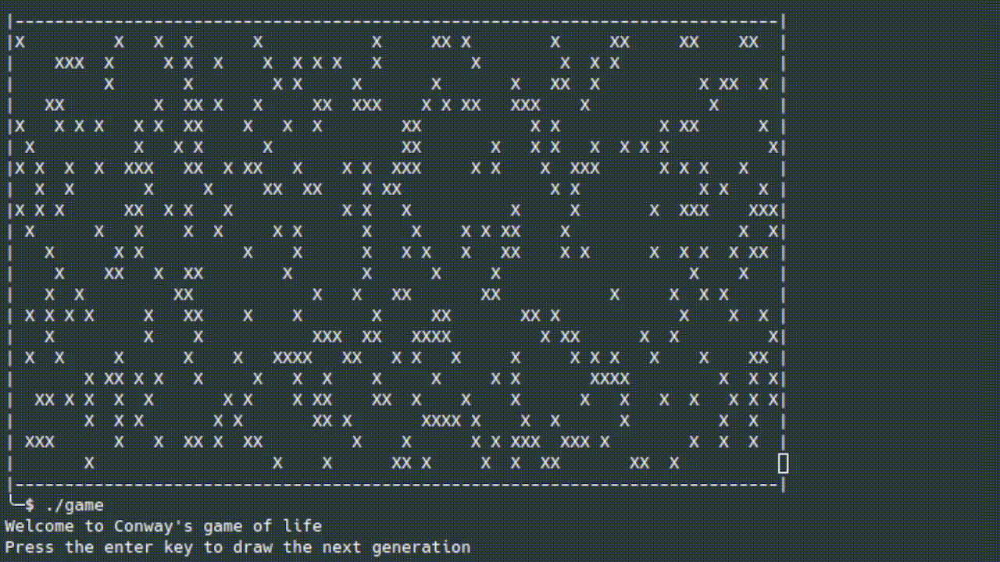

# Conway's Game of Life

This is a C++ implementation of John Conway's Game of Life, a classic cellular automaton.

## How It Works

The program simulates a two-dimensional grid of cells, where each cell can be either alive or dead. The simulation proceeds in discrete time steps, called generations. The state of each cell in the next generation is determined by a set of rules based on its neighbors in the current generation.

## Screenshot



## Build and Run

```bash
make
./game
```
